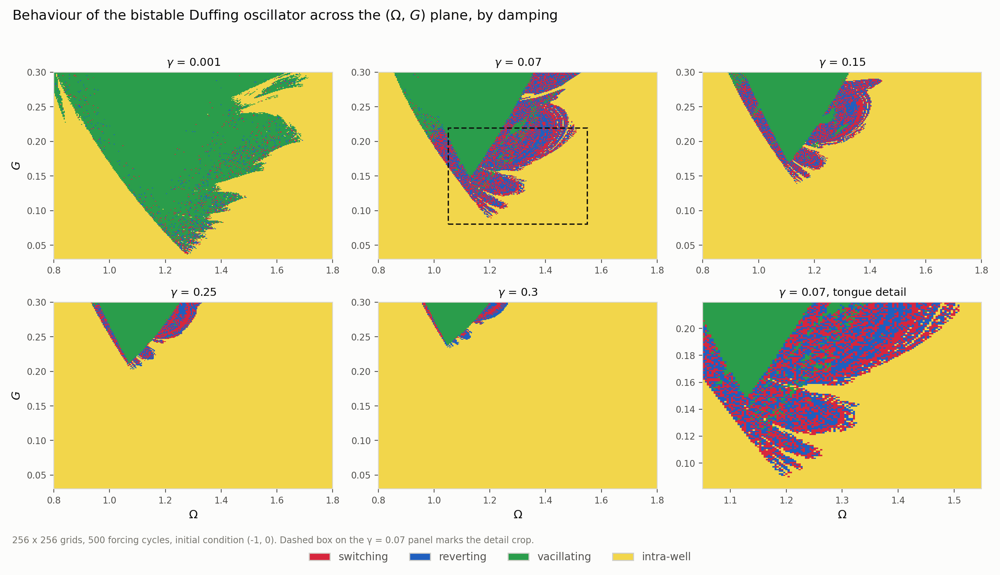
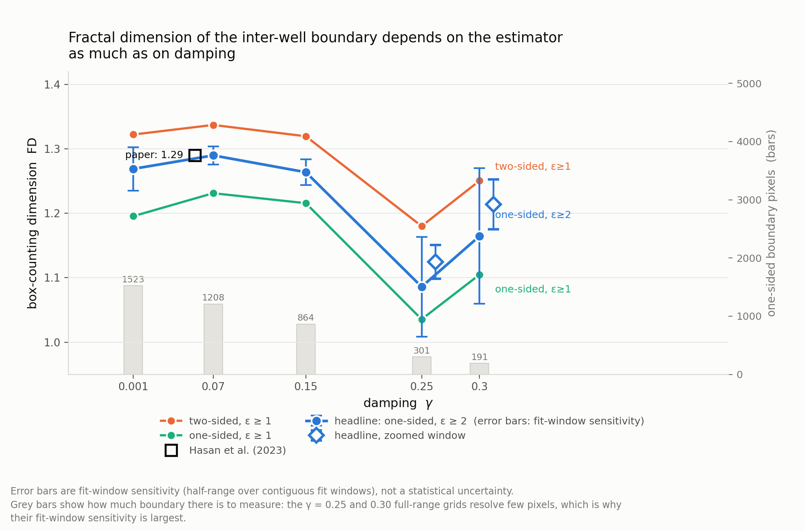

# Reproduction: Fractal patterns in the parameter space of a bistable Duffing oscillator (Hasan et al., PRE 2023)

> M. N. Hasan, T. E. Greenwood, R. G. Parker, Y. L. Kong, P. Wang,
> *Fractal patterns in the parameter space of a bistable Duffing oscillator*,
> Phys. Rev. E **108**, L022201 (2023); arXiv:2301.13113.

Independent reproduction by Galib Muhammad Kassaf (Islamic University of
Technology, Bangladesh), September 2026. Not affiliated with the authors.

Governing equation (their Eq. 2, `mu = 1`):

```
u'' + gamma*u' - u + u^3 = G cos(Omega*tau),    (u, u')|_0 = (-1, 0)
```

Protocol, unchanged from the paper: fixed-step RK4, 500 forcing cycles, the last
50 cycles taken as steady state, and the four-way classification
(intra-well / switching / reverting / vacillating) on a 256 x 256 grid over
`0.80 <= Omega <= 1.8`, `0.03 <= G <= 0.30`.

## Results



`FD` is the box-counting dimension of the inter-well / intra-well boundary.
The headline estimator is **one-sided boundary, fit over `2 <= eps <= n/4`**.
The quoted `±` is **fit-window sensitivity (half-range)** — the half-range of the
slope over every contiguous fit window of >= 4 box sizes. It measures how much the
answer depends on where the scaling window is placed; it is **not** a statistical
uncertainty and carries no confidence level. The last two FD columns are
disclosure, not alternatives — see [Estimator sensitivity](#estimator-sensitivity).

| gamma | G_min | **FD (headline)** ± fit-window sensitivity | FD two-sided, eps>=1 | FD one-sided, eps>=1 | boundary px | switching | reverting | vacillating | intra-well |
|------:|------:|:------------------------------------------:|---------------------:|---------------------:|------------:|----------:|----------:|------------:|-----------:|
| 0.001 | 0.0364 | 1.269 ± 0.034 | 1.322 | 1.196 | 1523 | 1.28% | 1.31% | 44.63% | 52.78% |
| 0.07  | 0.0893 | 1.290 ± 0.014 | 1.337 | 1.231 | 1208 | 6.76% | 6.80% | 15.78% | 70.66% |
| 0.15  | 0.1391 | 1.264 ± 0.020 | 1.320 | 1.216 |  864 | 3.92% | 3.75% | 10.53% | 81.81% |
| 0.25  | 0.2026 | 1.086 ± 0.077 | 1.180 | 1.036 |  301 | 1.44% | 1.31% |  5.20% | 92.05% |
| 0.30  | 0.2344 | 1.165 ± 0.105 | 1.251 | 1.105 |  191 | 0.51% | 0.65% |  2.89% | 95.94% |

Zoom runs, 256 x 256 concentrated on the region that actually contains boundary:

| gamma | window | **FD (headline)** ± fit-window sensitivity | boundary px (one-sided / two-sided) |
|------:|--------|:------------------------------------------:|------------------------------------:|
| 0.25 | `Omega` 1.0–1.6, `G` 0.18–0.30 | 1.125 ± 0.026 | 638 / 1255 |
| 0.30 | `Omega` 1.0–1.6, `G` 0.21–0.30 | 1.214 ± 0.039 | 501 / 995 |



*Zoom-window values sample the boundary at a finer parameter scale than the
full-range values and are not directly comparable across gamma.*

At full range, `FD(0.30) - FD(0.25) = 0.079` against combined half-ranges of
0.183 — the ordering is **not** resolved. Within the zoom runs the gap is 0.090
against combined half-ranges of 0.065, so `FD(0.30) > FD(0.25)` **is** resolved
there. The full-range grids for these two gammas spend most of their pixels on
featureless intra-well space; they under-resolve the boundary rather than
measuring a lower dimension.

## Physical reading

**The static threshold is 0.385.** The potential is `V(u) = -u^2/2 + u^4/4`, so the
restoring force is `u - u^3`, which peaks at `u = 1/sqrt(3)`. A quasi-static load
must exceed

```
G_static = 2/(3*sqrt(3)) = 0.3849
```

to push the mass over the hilltop at `u = 0` at all.

**Harmonic forcing beats it by a factor of four.** At `gamma = 0.07` inter-well
motion first appears at `G_min = 0.089`, which is **23% of the static threshold**.
Driving the oscillator near resonance lets it accumulate energy over many cycles
instead of paying the full barrier in one push. The ratio grows with damping —
9.4% at `gamma = 0.001`, 23.2% at 0.07, 36.1% at 0.15, 52.6% at 0.25, 60.9% at
0.30 — because dissipation removes the energy that accumulation supplies.

**The threshold is linear in damping.** Least squares over the five runs:

```
G_min = 0.0395 + 0.654*gamma        R^2 = 0.9987
```

Residuals (`G` grid spacing is 0.00106, so one grid row = 0.0011):

| gamma | G_min | fit | residual |
|------:|------:|----:|---------:|
| 0.001 | 0.0364 | 0.0401 | −0.0038 |
| 0.07  | 0.0893 | 0.0853 | +0.0040 |
| 0.15  | 0.1391 | 0.1376 | +0.0015 |
| 0.25  | 0.2026 | 0.2030 | −0.0004 |
| 0.30  | 0.2344 | 0.2357 | −0.0013 |

rms residual 0.0026, max |residual| 0.0040 — about 2.5 and 3.8 grid rows. The
residuals are not pure discretisation noise, but they are small, and the sign
pattern (− + + − −) is what a mild convexity in `G_min(gamma)` would produce.

**The intercept is a property of the protocol, not physics.** A linear
extrapolation to `gamma = 0` predicts `G_min = 0.0395`. In the undamped limit the
escape threshold is set by nonlinear resonance rather than dissipation, and
KAM-type confinement means an arbitrarily small `G` need not escape at all. Within
a 500-cycle window the intercept is a property of the protocol; no zero-damping
limit is claimed. Crossings that would first occur at cycle 10 000 are not seen at
all, so the fit describes the five sampled dampings and should not be extrapolated
past them. See the [`gamma = 0.001` caveat](#caveat-the-gamma--0001-row), where the
finite window is not a distant limit but the actual operating regime.

## Estimator sensitivity

FD moves more between estimators than it does across gamma, so the estimator has
to be stated alongside the number. Two effects:

**Two-sided bias.** The original mask marks every pixel that has a neighbour of
the other class, so it flags both sides of each interface and the boundary set is
about 2 pixels thick (e.g. 2122 vs 1208 pixels at `gamma = 0.07`). The surplus is
concentrated at small `eps`, where the doubled set still occupies roughly twice as
many boxes, while at large `eps` both sides fall in the same box and the counts
converge. That tilts `log N` vs `log(1/eps)` upward at the fine end and inflates
the slope by 0.10–0.15. The one-sided mask — inter-well pixels with at least one
intra-well 4-neighbour — is 1 pixel thick and removes the double count.

**`eps = 1` saturation.** For a 1-pixel-thick set, `N(1)` is exactly the pixel
count, which is the largest value the curve can take and is set by grid
resolution rather than by geometry. Including it anchors the fit at a saturated
point and biases the slope *down*; dropping it recovers about half the difference
(e.g. 1.231 -> 1.290 at `gamma = 0.07`). Hence the headline fit starts at
`eps = 2`.

The two effects push in opposite directions, which is why the original
two-sided/`eps>=1` number (1.337 at `gamma = 0.07`) lands close to the headline
value (1.290) despite both of its ingredients being biased.

## What is reproducible

Re-running `gamma = 0.07` at `n = 128` with `spc = 200` and `spc = 400`:

- **868 of 16384 pixels (5.3%) change category**
- **3 pixels (0.018%) change inter/intra status**

Nearly all the churn is switching <-> reverting (314 one way, 315 the other) plus
~120 exchanges with vacillating. This is the expected structure, and it draws a
sharp line through the results:

*Well selection is chaotic and is not pixel-reproducible.* Which well a
trajectory occupies after 500 cycles depends on the integration step size, so the
red/blue texture inside the tongue is not a converged, pixel-addressable
prediction. Only its aggregate fractions are meaningful, and those are stable to
< 0.1 pp.

*Hilltop crossing is converged.* Whether the trajectory ever passes `u = 0` is
insensitive to step size — 3 pixels in 16384. `G_min` shifts by 0.002126, which
is exactly one grid row at `n = 128`, the smallest representable change.

*FD is computed on the converged quantity.* The box count runs on the
inter-well / intra-well boundary, not on the switching/reverting interface, so
the 5.3% category churn does not propagate into it: FD moves by 0.003
(1.3186 -> 1.3154, two-sided). Do not compute a dimension for the
switching/reverting boundary with this protocol — that number would not be
reproducible.

## Caveat: the `gamma = 0.001` row

The linearised envelope about a well decays as `exp(-gamma*tau/2)`, i.e. a decay
time of `2/gamma = 2000` in `tau`, which at `Omega ~ 1.2` (period `2*pi/Omega ~ 5.24`)
is **~380 forcing cycles** against a 500-cycle run. At the start of the averaging
window (cycle 450) roughly 30% of the initial transient amplitude is still
present, so the last 50 cycles are not a steady state at this damping.

This is a property of the protocol, which is kept as published, not a bug. But it
means the `gamma = 0.001` row is measuring a partly-transient state: its 44.6%
vacillating fraction is inflated by trajectories still ringing down, and its FD
should be read as the least trustworthy of the five. The other gammas are fine —
at `gamma = 0.07` the decay time is ~5.5 cycles.

## Determinism: the `u ** 3.0` detail

The numba fast path is **bit-for-bit identical** to the NumPy reference, not
merely close. That is a requirement rather than a nicety: the trajectories are
chaotic over 100 000 steps, so a 1-ULP difference would be amplified into flipped
categories along the fractal boundary, exactly where the measurement happens.

The one operation that does not agree naively is the cubic term. NumPy's `u**3`
on a float64 array dispatches to libm `pow()`, whereas numba compiles the integer
exponent `u ** 3` into `u*u*u` — the two disagree in the last bit for about 25% of
inputs. Writing the exponent as a float, `u ** 3.0`, forces numba to emit the same
`pow()` call and the paths agree exactly. (`np.cos` already matched bit-for-bit,
so it needed no such treatment.) The `xi_max`/`xi_min` updates likewise reproduce
`np.maximum`/`np.minimum` NaN propagation rather than using a bare comparison.

Verified: at 48 x 48 the categories, `ever_crossed`, `xi_max` and `xi_min` are all
bit-identical at both 100 and 500 cycles, and the 96 x 96 smoke test matches on
both backends. The fast path is ~8.3x faster at production depth (173 s vs ~20 min
for a 256 x 256 / 500-cycle sweep) and is **off by default**; pass `--backend numba`.

## Usage

```bash
python3 -m venv .venv && .venv/bin/pip install numpy matplotlib numba
```

The `.npz` grids are not tracked in git — regenerate them with the sweeps below
(~3 min each with numba), then rebuild the CSVs and figures.

```bash
# the five full-range sweeps
for g in 0.001 0.070 0.150 0.250 0.300; do
    .venv/bin/python duffing_parameter_space.py --gamma $g --backend numba \
        --out results/duffing_gamma${g}_n256.png
done

# the two zoom runs
.venv/bin/python duffing_parameter_space.py --gamma 0.250 --backend numba \
    --omega 1.0 1.6 --G 0.18 0.30 --out results/zoom/duffing_gamma0.250_zoom_n256.png
.venv/bin/python duffing_parameter_space.py --gamma 0.300 --backend numba \
    --omega 1.0 1.6 --G 0.21 0.30 --out results/zoom/duffing_gamma0.300_zoom_n256.png

# step-size sensitivity check
.venv/bin/python duffing_parameter_space.py --gamma 0.07 --n 128 --spc 200 --backend numba \
    --out results/duffing_gamma0.070_n128_spc200.png
.venv/bin/python duffing_parameter_space.py --gamma 0.07 --n 128 --spc 400 --backend numba \
    --out results/duffing_gamma0.070_n128_spc400.png

# derived products
.venv/bin/python fd_estimators.py                                    # results/fd_estimators.csv
.venv/bin/python fd_estimators.py --glob "results/zoom/*.npz" \
    --out results/zoom/fd_estimators_zoom.csv
.venv/bin/python make_summary.py                                     # results/summary.csv
.venv/bin/python make_fig1.py                                        # figures/fig1_gamma_panels.png
.venv/bin/python make_fig2.py                                        # figures/fig2_fd_vs_gamma.png
```

`run_remaining.sh` and `run_zoom.sh` are the drivers as actually run.
Relevant flags: `--gamma --n --cycles --spc --omega --G --backend --boundary --fit-min-eps --out`.

## Layout

| Path | What | Tracked |
|------|------|---------|
| `duffing_parameter_space.py` | sweep, classification, boundary extraction, box counting | yes |
| `fd_estimators.py` | FD under the headline + disclosure estimators, with fit-window sensitivity | yes |
| `make_summary.py` | builds `results/summary.csv` | yes |
| `make_fig1.py`, `make_fig2.py` | build the two figures | yes |
| `run_remaining.sh`, `run_zoom.sh` | the production sweeps as run | yes |
| `figures/*.png` | the two figures | yes |
| `results/*.csv` | `summary.csv`, `fd_estimators.csv` | yes |
| `results/**/*.png` | per-run parameter-space maps | yes |
| `results/**/*.npz` | per-run category grids | **no** — regenerate with the sweep commands above |
| `logs/` | stdout of every production run | **no** — regenerated by the sweep commands |
